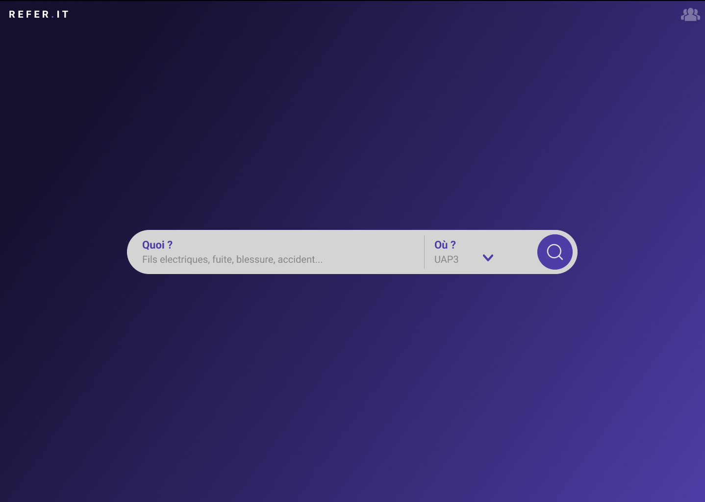

# Cahier des Charges Fonctionnel (CDCF)

## Présentation du Projet : Qui fait Quoi ?

Le projet consiste à créer une application web de type _"site vitrine"_ / _"moteur de recherche"_. Cette application permettra aux utilisateurs de SANOFI AMBARES de réaliser une recherche par mots clefs / Emplacement afin d'être redirigé vers le référent HSE / SG le plus adapté.

## Besoins et Objectifs

Besoin Identifiés :

-   Un utilisateur doit pouvoir consulter la liste des référents HSE / SG de l'entreprise ; l'identité (Nom / prénom / photo), le poste, et les coordonnées sont exposés publiquement.
-   Un utilisateur doit pouvoir consulter les détails d'un référent en particulier.
-   Un utilisateur doit pouvoir avoir une recommandation fiable du référent concerné par sa recherche.
-   Un utilisateur doit pouvoir réaliser une recherche par couple mots-clefs / lieu / zone.

Objectifs du Projet :

-   Fournir une interface utilisateur simple et intuitive.
-   Permettre aux utilisateurs d'effectuer une recherche simple et rapide pour identifier le bon référent
-   Permettre aux utilisateurs de visualiser l'entièreté des référents HSE / SG du site.
-   Permettre aux utilisateurs d'obtenir des informations spécifiques à un référent et de pouvoir le contacter via des CTA.

## Fonctionnalités du Projet

**Spécifications Fonctionnelles** :

1. Effectuer une recherche par mots clefs et zone.

> Un utilisateur peut effectuer une recherche par mots clefs et zone via la page d'accueil.

2. Consulter la fiche contact d'un référent.

> Un utilisateur peut visualiser la fiche contact d'un référent et le contacter par _mail_

3. Consulter l'ensemble des référents HSE / SG du site et les contacter.

> -   Un utilisateur peut visualiser l'ensemble des référents du site
> -   Un utilisateur peut contacter ces référents via son _mail_ ou téléphone.

**Évolutions Potentielles** : aucune évolution potentielle recensée à ce jour ;

## Cible du Projet

Le public cible de ce projet sont l'ensemble des employés de SANOFI AMBARES susceptibles de devoir contacter un référent HSE / SG.

## Arborescence de l'Application

**Page d'Accueil** :

-   Barre de recherche
-   Lien renvoyant a la liste des référents.

**Page de référent suggeré** :

-   Détails sur le référent suggeré selon la recherche.

**Page de liste des référents** :

-   Liste des référents HSE / SG du site.

## Liste des User Stories

| User Story | En tant que... | Je veux...                                                | Depuis...                       |
| ---------- | -------------- | --------------------------------------------------------- | ------------------------------- |
| 1          | Utilisateur    | pouvoir effectuer une recherche par mots-clefs / zone     | la page d'accueil.              |
| 2          | Utilisateur    | pouvoir visualiser l'ensemble des référents               | la page de liste des référents. |
| 3          | Utilisateur    | pouvoir visualiser le référent suggeré selon ma recherche | la page de référent suggeré.    |
| 4          | Utilisateur    | pouvoir contacter le référent suggeré                     | la page de référent suggeré.    |

## Use Cases Diagramme (UC)
TBD


## Diagramme de Classe

TBD

<!--  -->

## Entités-Relations Diagramme (ERD)

<!-- ```plantuml
@startuml

entity "Project" as e01 {
  *project_id : number <<generated>>
  --
  *owner_id : number <<FK>>
  *private: boolean
  *archived:  boolean
  *name: text
  *full_name: text
  *description : text
  *language: text
  *html_url: text
  license: text
  created_at: date
  updated_at: date
}

entity "Owner" as e02 {
  *owner_id : number <<generated>>
  --
  *login: text
  *html_url: text
  *type: text
  avatar_url: text
  created_at: date
  updated_at: date
}

e02 }o----|| e01

@enduml
``` -->
TBD


## Maquettes

Page d'accueil :



Page de résultat de recherche :


Liste des référents :


