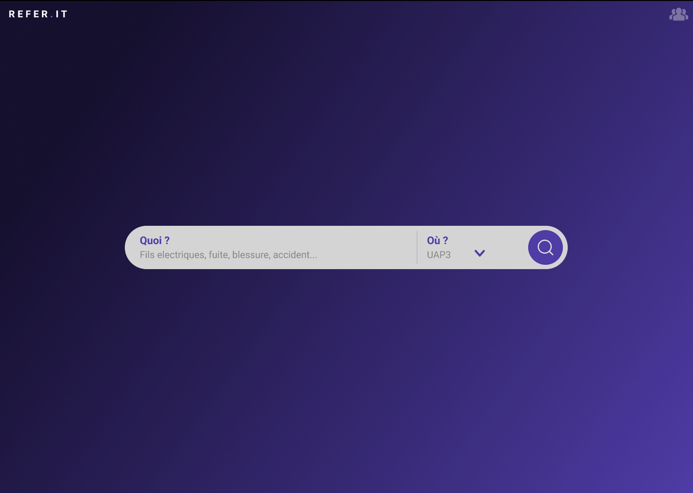
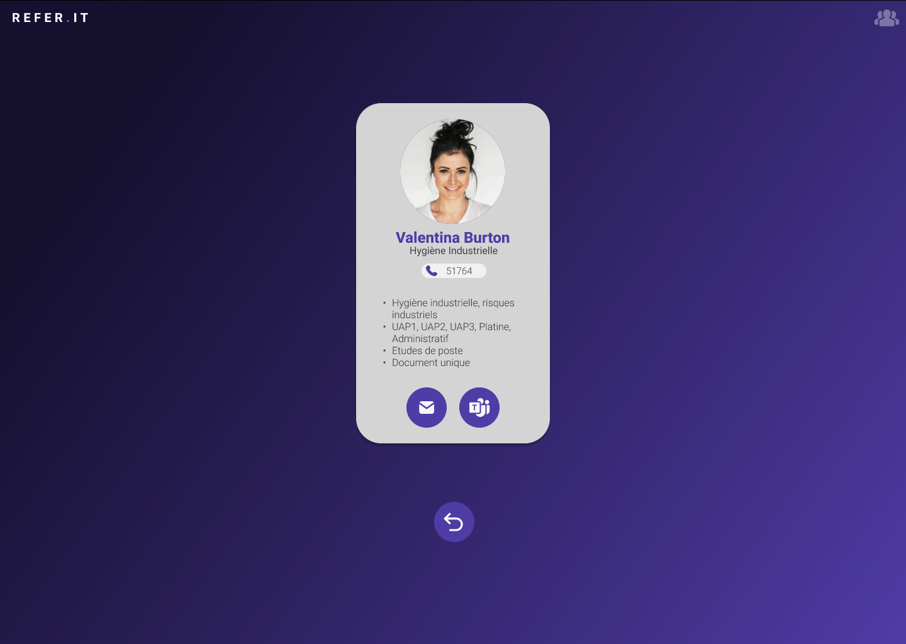
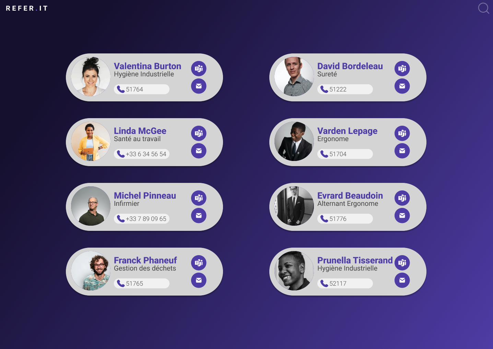

# SANOFI Search Tool - Refer.it - 

<!--  -->

<!--  -->

Moteur de recherche interne pour SANOFI AMBARES, permettant d'effectuer une recherche du référent adapté selon mots-clefs / zone.

Lien vers le [Cahier des charges fonctionnel](./CDCF.md)

---

## 🛠 Tech Stack

**Client:**

**Back-Office:**
TBD

**Server:**

**Other:**

---

## 💡 Features

---

## 💻 Softwares used

---

## 📲 Deployment

<!-- 
 -->

TBD

---

<!-- ## 🎨 Color Reference

| Color      | Hex                                                                |
| ---------- | ------------------------------------------------------------------ |
| Turquoise  |  `#1ABC9C` |
| Dark grey  |  `#19242e` |
| Light grey |  `#34495E` |
| Silver     |  `#BDC3C7` |

--- -->

## 📸 Screenshots

---

## 🔗 Links

